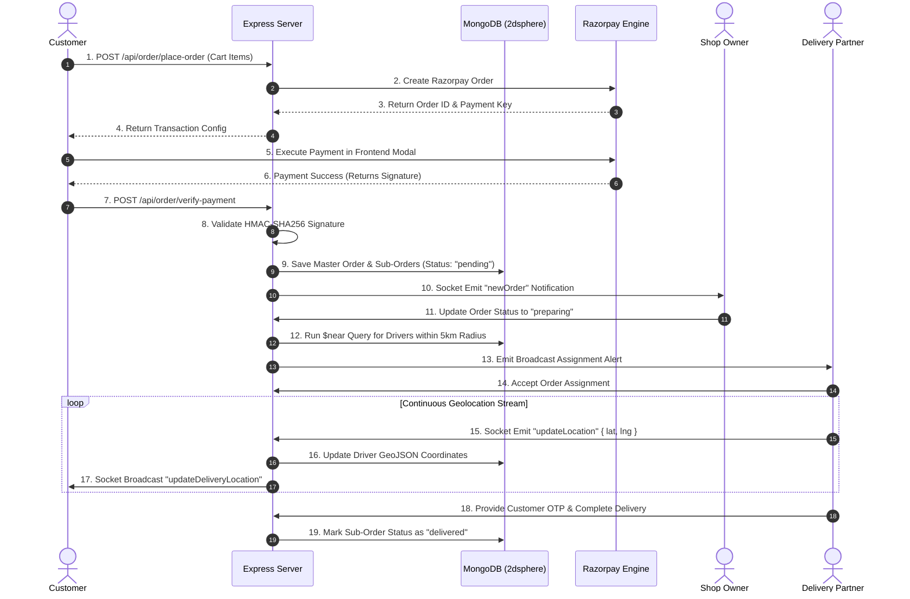
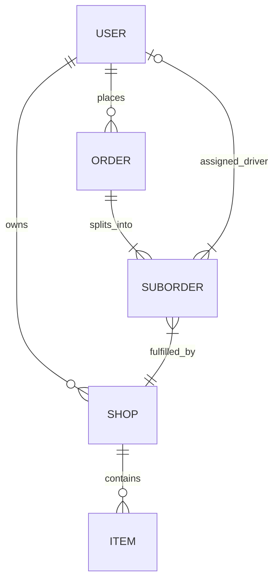

# 🚀 Vingo — Enterprise Real-Time Food Delivery & Logistics Platform

Welcome to the central repository for **Vingo**, a full-stack, enterprise-grade, real-time hyper-local food ordering and delivery system. Vingo connects Customers, Restaurant Owners, and Delivery Partners on a unified asynchronous platform powered by **React 18 (Vite)**, **Node.js**, **Express.js**, **MongoDB (Mongoose)**, **Socket.IO**, **Razorpay**, and **Cloudinary**.

---

## 📋 Table of Contents

1. [Executive Summary & Vision](#-1-executive-summary--vision)
2. [Multi-Role Persona Matrix](#-2-multi-role-persona-matrix)
3. [Technology Stack & Architectural Justifications](#-3-technology-stack--architectural-justifications)
4. [System Architecture & End-to-End Data Flows](#-4-system-architecture--end-to-end-data-flows)
5. [Database Schema & Geospatial Indexing](#-5-database-schema--geospatial-indexing)
6. [Real-Time WebSocket Protocol Specifications](#-6-real-time-websocket-protocol-specifications)
7. [Security, Authentication & Cryptography](#-7-security-authentication--cryptography)
8. [Frontend State Management Architecture](#-8-frontend-state-management-architecture)
9. [Interview Deep-Dive: Core Follow-Up Questions & Answers](#-9-interview-deep-dive-core-follow-up-questions--answers)
10. [Local Environment Setup & Deployment Blueprint](#-10-local-environment-setup--deployment-blueprint)

---

## 🎯 1. Executive Summary & Vision

Vingo solves the complex engineering challenge of **multi-vendor order aggregation, real-time spatial driver matching, payment reconciliation, and low-latency GPS tracking**. 

Traditional food delivery applications suffer from split payments and disconnected tracking. Vingo overcomes these hurdles by implementing:
* **Multi-Shop Sub-Order Cart Architecture:** Customers can aggregate items from multiple stores into a single checkout cart, which the backend automatically partitions into shop-specific sub-orders for vendor fulfillment.
* **Geospatial Proximity Matchmaking:** Uses MongoDB `2dsphere` spatial indexing to calculate distance vectors between restaurants and active drivers, dispatching orders to the nearest driver within a 5 km radius.
* **Low-Latency Bi-Directional GPS Tracking:** Utilizes Socket.IO WebSockets to stream continuous driver coordinate updates directly to the customer map interface without database thrashing.
* **Tamper-Proof Payment Validation:** Integrates Razorpay with server-side HMAC-SHA256 signature verification.

---

## 👥 2. Multi-Role Persona Matrix

Vingo dynamically morphs its UI and backend permissions based on three authenticated roles:

```
                               ┌─────────────────────────────────────────┐
                               │             USER ROLES                  │
                               └────────────────────┬────────────────────┘
                                                    │
        ┌───────────────────────────────────────────┼───────────────────────────────────────────┐
        ▼                                           ▼                                           ▼
┌──────────────┐                            ┌──────────────┐                            ┌──────────────┐
│  CUSTOMER    │                            │  SHOP OWNER  │                            │ DELIVERY BOY │
├──────────────┤                            ├──────────────┤                            ├──────────────┤
│ • Shop Feed  │                            │ • Shop Setup │                            │ • Order Alert│
│ • Cart Logic │                            │ • Menu Items │                            │ • Accept Job │
│ • Razorpay   │                            │ • Live Orders│                            │ • GPS Stream │
│ • Live Map   │                            │ • Status Step│                            │ • OTP Finish │
└──────────────┘                            └──────────────┘                            └──────────────┘
```

| Feature / Capability | Customer | Shop Owner | Delivery Partner |
| :--- | :---: | :---: | :---: |
| Browse Shops & Menus | ✅ | ❌ | ❌ |
| Multi-Vendor Cart & Razorpay Checkout | ✅ | ❌ | ❌ |
| Live Leaflet Map Order Tracking | ✅ | ❌ | ❌ |
| Create & Edit Restaurant Profile | ❌ | ✅ | ❌ |
| Add, Edit & Delete Menu Items (Cloudinary) | ❌ | ✅ | ❌ |
| Receive Real-Time Order Broadcasts | ❌ | ✅ | ✅ |
| Update Order Preparation Status | ❌ | ✅ | ❌ |
| Stream Live GPS Location via WebSockets | ❌ | ❌ | ✅ |
| Verify Delivery via Customer OTP | ✅ (Provides OTP) | ❌ | ✅ (Inputs OTP) |

---

## 🛠️ 3. Technology Stack & Architectural Justifications

| Layer | Technology Used | Why This Tech? (Architectural Justification) |
| :--- | :--- | :--- |
| **Frontend Framework** | **React 18 + Vite** | Provides ultra-fast HMR during development and a high-performance single-page app (SPA) rendering model ideal for dynamic role-based dashboards. |
| **State Management** | **Redux Toolkit (`@reduxjs/toolkit`)** | Centralizes multi-role user sessions, cart state, item quantities, and dynamic driver geolocation vectors across unmounted pages. |
| **Styling Engine** | **TailwindCSS** | Enables clean utility-first design without heavy CSS bundles, ensuring mobile responsiveness across all devices. |
| **Map Rendering Engine** | **React-Leaflet / Leaflet** | Open-source, lightweight canvas/SVG map rendering engine. Avoids Google Maps API billing constraints while supporting custom marker icons and real-time polyline movements. |
| **Backend Runtime** | **Node.js + Express.js** | Asynchronous, non-blocking I/O event-loop runtime perfectly suited for handling high-concurrency WebSocket connections and REST endpoints. |
| **Database Engine** | **MongoDB + Mongoose ORM** | Schema-flexible document database featuring native **`2dsphere` spatial indexing**, enabling sub-millisecond distance queries (`$near`, `$geoNear`). |
| **Real-Time Layer** | **Socket.IO** | Full-duplex WebSocket connection gateway featuring automatic fallback to HTTP long-polling, heartbeat monitoring, and instant pub/sub room broadcasting. |
| **Payment Gateway** | **Razorpay SDK** | Offers native Indian UPI, Card, and Netbanking processing with server-side HMAC-SHA256 signature verification for zero financial tampering. |
| **Media CDN** | **Cloudinary + Multer** | Decouples binary media storage from application servers. Images are buffered in RAM via Multer and uploaded to Cloudinary CDN for instant global optimization. |

---

## 🏗️ 4. System Architecture & End-to-End Data Flows

### Macro System Architecture Diagram

```
+---------------------------------------------------------------------------------------------------------+
|                                           CLIENT APPLICATIONS                                           |
|       [Customer Web App]          [Shop Owner Dashboard]          [Delivery Partner Driver App]         |
+---------------------------------------------------------------------------------------------------------+
                                 |                                           |
                         HTTP REST Request                               Sockets (WS)
                                 |                                           |
                                 v                                           v
+---------------------------------------------------------------------------------------------------------+
|                                      EXPRESS.JS & SOCKET.IO SERVER                                      |
|  +---------------------------------------------------------------------------------------------------+  |
|  | Middleware: CORS | Cookie Parser | JWT Auth Guard (isAuth) | Multer Memory Engine               |  |
|  +---------------------------------------------------------------------------------------------------+  |
|  | Controllers: AuthController | ShopController | ItemController | OrderController | SocketGateway   |  |
+---------------------------------------------------------------------------------------------------------+
                                 |                                           |
                                 v                                           v
+---------------------------------------------------------------------------------------------------------+
|                                    DATA BASE & EXTERNAL ECOSYSTEM                                       |
|  +---------------------------+  +---------------------------------+  +-------------------------------+  |
|  | MongoDB Datastore         |  | Razorpay Payment Gateway        |  | Cloudinary Asset Storage      |  |
|  | (2dsphere Spatial Index)  |  | (Order Creation & Validation)   |  | (Optimized Image Streaming)   |  |
|  +---------------------------+  +---------------------------------+  +-------------------------------+  |
+---------------------------------------------------------------------------------------------------------+
```

### Complete End-to-End Execution Sequence Chart



---

## 💾 5. Database Schema & Geospatial Indexing

### Entity-Relationship Architecture



### Key Schemas Summary

#### 1. User Schema (`backend/models/user.model.js`)
* `email`: String (Unique, Indexed)
* `password`: String (Bcrypt Hashed)
* `role`: Enum `['customer', 'owner', 'deliveryBoy']`
* `location`: GeoJSON Point `{ type: "Point", coordinates: [longitude, latitude] }`
* **Spatial Index:** `UserSchema.index({ location: "2dsphere" })`

#### 2. Order & Sub-Order Schema (`backend/models/order.model.js`)
Supports multi-vendor cart partitioning:
* `user`: ObjectId reference to Customer
* `subOrders`: Array of sub-documents:
  * `shop`: ObjectId reference to Shop
  * `items`: Array of `{ item, quantity }`
  * `subTotal`: Number
  * `status`: Enum `['pending', 'preparing', 'out_for_delivery', 'delivered', 'cancelled']`
  * `deliveryBoy`: ObjectId reference to Driver
  * `otp`: 4-digit verification code

---

## ⚡ 6. Real-Time WebSocket Protocol Specifications

The system utilizes Socket.IO for real-time state synchronization across parties.

```
+----------------------------------------------------------------------------------------------------+
|                                    SOCKET EVENT REGISTRY GATEWAY                                    |
+----------------------+-------------------+--------------------+------------------------------------+
| Event Name           | Source            | Target             | Payload Structure                  |
+----------------------+-------------------+--------------------+------------------------------------+
| identity             | Any Client        | Server             | { userId: String }                 |
| updateLocation       | Delivery Driver   | Server             | { latitude, longitude, userId }    |
| updateDeliveryLoc... | Server            | Customer           | { deliveryBoyId, latitude, lng }   |
| newOrder             | Server            | Shop Owner         | { order: Object }                  |
| disconnect           | System            | Server             | Automatically updates isOnline: false|
+----------------------+-------------------+--------------------+------------------------------------+
```

---

## 🔐 7. Security, Authentication & Cryptography

1. **Stateless JWT via HTTP-Only Cookies:** Auth tokens are signed server-side and stored in `httpOnly: true`, `sameSite: "strict"` cookies. This eliminates client-side LocalStorage vulnerability to Cross-Site Scripting (XSS).
2. **Password Cryptography:** Hashed using `bcryptjs` with 10 salt rounds.
3. **Razorpay HMAC-SHA256 Signature Math:**
   ```javascript
   const body = razorpay_order_id + "|" + razorpay_payment_id;
   const expectedSignature = crypto
     .createHmac("sha256", process.env.RAZORPAY_KEY_SECRET)
     .update(body.toString())
     .digest("hex");
   const isValid = (expectedSignature === razorpay_signature);
   ```

---

## 🧠 8. Frontend State Management Architecture

```
Redux Toolkit Central Store (src/redux/store.js)
├── userSlice   -> User Auth State, Cart Items Array, Role, Active Orders History
├── ownerSlice  -> Vendor Shop Profile, Menu Items Array, Received Shop Orders
└── mapSlice    -> User Delivery Address Coords, Driver Dynamic Live Coordinates
```

---

## 🎓 9. Interview Deep-Dive: Core Follow-Up Questions & Answers

### Q1: How does Vingo handle multi-vendor orders in a single cart?
> **Answer:** The frontend allows users to add food items from different shops into a unified Redux cart. Upon checkout, the backend `/api/order/place-order` controller reads the item array and groups them by their parent `shop` ID. It calculates individual `subTotal` values and constructs an array of `subOrders` within a single master `Order` document. This allows a single Razorpay payment while permitting each vendor to accept and prepare their sub-order independently.

### Q2: How does the driver assignment geospatial matching algorithm work?
> **Answer:** When a vendor changes an order status to `preparing`, the backend performs a MongoDB `$near` query on the `User` collection filtered by `role: "deliveryBoy"` and `isOnline: true`. MongoDB uses the `2dsphere` spatial index to calculate spherical distance relative to the shop's GeoJSON point `[longitude, latitude]`, returning available drivers within a 5,000-meter radius. The server then dispatches an assignment alert via WebSockets to the nearest available driver.

### Q3: Why use WebSockets for live driver location tracking instead of HTTP Polling?
> **Answer:** HTTP polling introduces massive overhead due to repeated HTTP header parsing, connection setup/teardown, and high latency (typically 3-5 seconds interval). WebSockets maintain a persistent TCP connection with minimal frame header overhead (~2 bytes). This enables 1-second continuous driver coordinate streaming without thumping the database or choking server bandwidth.

### Q4: How is JWT authentication secured against XSS and CSRF?
> **Answer:** JWT tokens are sent in an `HTTP-Only` cookie rather than LocalStorage. Because `HTTP-Only` cookies cannot be accessed via JavaScript (`document.cookie`), malicious XSS scripts injected into the browser cannot steal the access token. To mitigate CSRF, cookies use `sameSite: "strict"` mode and API requests require `withCredentials: true` across trusted origins.

### Q5: How do you verify that a delivery is genuine upon arrival?
> **Answer:** When an order is placed, the backend generates a random 4-digit One-Time Password (OTP) attached to the sub-order document. When the delivery driver arrives at the customer's location, the driver requests the OTP from the customer and enters it into the Driver App interface. The server validates the submitted OTP against the database record before transitioning the order status to `delivered`.

---

## ⚙️ 10. Local Environment Setup & Deployment Blueprint

### Prerequisites
* **Node.js** (v18.0.0 or higher)
* **MongoDB** (Local instance or MongoDB Atlas URI)
* **Cloudinary Account** (For image asset management)
* **Razorpay Test Account** (For payment gateway keys)

### Step 1: Clone & Configure Backend
```bash
cd backend
npm install
```

Create a `.env` file in `backend/.env`:
```env
PORT=5000
MONGO_URI=mongodb+srv://<username>:<password>@cluster.mongodb.net/vingo
JWT_SECRET=your_jwt_secret_key
RAZORPAY_KEY_ID=your_razorpay_key_id
RAZORPAY_KEY_SECRET=your_razorpay_key_secret
CLOUDINARY_CLOUD_NAME=your_cloudinary_cloud_name
CLOUDINARY_API_KEY=your_cloudinary_api_key
CLOUDINARY_API_SECRET=your_cloudinary_api_secret
EMAIL_USER=your_email@gmail.com
EMAIL_PASS=your_email_app_password
```

Start Backend Development Server:
```bash
npm run dev
```

### Step 2: Configure & Launch Frontend
```bash
cd ../frontend
npm install
```

Create a `.env` file in `frontend/.env`:
```env
VITE_BACKEND_URL=http://localhost:5000
VITE_RAZORPAY_KEY_ID=your_razorpay_key_id
```

Start Frontend Development Server:
```bash
npm run dev
```

The application will be accessible at `http://localhost:5173`.
