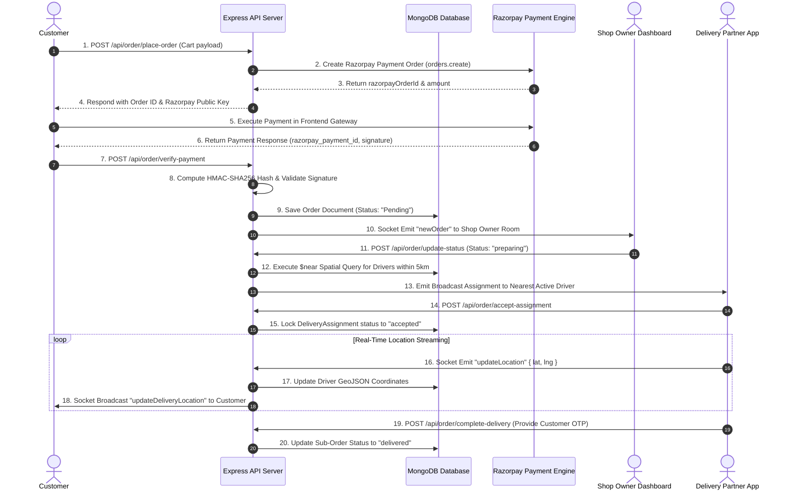
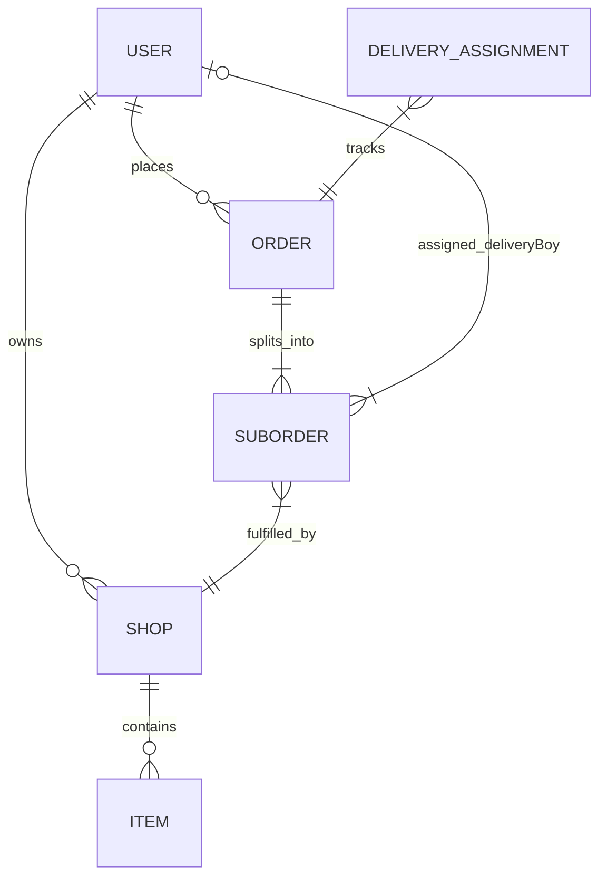

# 🏗️ Vingo Backend — Deep System & Backend Architecture Specification

Welcome to the comprehensive backend architecture document for **Vingo**, a multi-role, real-time hyper-local food delivery API server built on **Node.js**, **Express.js**, **MongoDB (Mongoose)**, **Socket.IO**, **Razorpay Engine**, and **Cloudinary CDN**.

---

## 🏛️ 1. Multi-Layer Backend Software Architecture

The Vingo backend follows a strict **Layered Controller-Service-Repository Pattern** augmented by an **Asynchronous Event Gateway**.

```
+---------------------------------------------------------------------------------------------------+
|                                        CLIENT ENTRY LAYER                                         |
|                 (React Single Page App / Shop Dashboard / Driver Mobile Client)                    |
+---------------------------------------------------------------------------------------------------+
                                        |                             |
                                 HTTP REST APIs               WebSockets (WS)
                                        |                             |
                                        v                             v
+---------------------------------------------------------------------------------------------------+
|                                     EXPRESS GATEWAY & MIDDLEWARE                                  |
|  +---------------------------+  +--------------------------+  +--------------------------------+  |
|  | CORS & Cookie Parser      |  | Auth Middleware (isAuth) |  | Multer Memory Storage Engine   |  |
|  +---------------------------+  +--------------------------+  +--------------------------------+  |
+---------------------------------------------------------------------------------------------------+
                                        |                             |
                                        v                             v
+---------------------------------------------------------------------------------------------------+
|                                      BUSINESS CONTROLLER LAYER                                    |
|  +------------------+  +------------------+  +------------------+  +---------------------------+  |
|  | AuthController   |  | OrderController  |  | ShopController   |  | SocketHandler             |  |
|  | (JWT, Bcrypt, OTP|  | (Cart, Razorpay, |  | (Vendor Setup,   |  | (Live GPS Broadcaster,    |  |
|  |  Email Transporter| |  Driver Dispatch) |  |  Menu Items CRUD)|  |  Room Management)         |  |
|  +------------------+  +------------------+  +------------------+  +---------------------------+  |
+---------------------------------------------------------------------------------------------------+
                                        |                             |
                                        v                             v
+---------------------------------------------------------------------------------------------------+
|                                     DATA ACCESS & EXTERNAL SERVICES                               |
|  +-----------------------------------+  +------------------------+  +--------------------------+  |
|  | MongoDB Database via Mongoose ORM |  | Razorpay Gateway SDK   |  | Cloudinary Media SDK     |  |
|  | (2dsphere Spatial Indexing)       |  | (Payment Sign Check)   |  | (Image Streaming Engine) |  |
|  +-----------------------------------+  +------------------------+  +--------------------------+  |
+---------------------------------------------------------------------------------------------------+
```

---

## 🔄 2. End-to-End Order & Real-Time Driver Assignment Sequence



---

## 💾 3. Exhaustive Database Schema & Indexing Specifications

MongoDB serves as the core datastore, leveraging **Geospatial GeoJSON indexing** for location query optimizations.



### 1. User Model Schema (`models/user.model.js`)
```javascript
{
  name: { type: String, required: true },
  email: { type: String, required: true, unique: true, index: true },
  password: { type: String, required: true },
  role: { 
    type: String, 
    enum: ["customer", "owner", "deliveryBoy"], 
    default: "customer" 
  },
  socketId: { type: String, default: null },
  isOnline: { type: Boolean, default: false },
  location: {
    type: { type: String, enum: ["Point"], default: "Point" },
    coordinates: { type: [Number], default: [0, 0] } // [longitude, latitude]
  },
  resetPasswordOTP: { type: String },
  otpExpires: { type: Date }
}
// INDEX: UserSchema.index({ location: "2dsphere" });
```

### 2. Shop Model Schema (`models/shop.model.js`)
```javascript
{
  name: { type: String, required: true },
  owner: { type: Schema.Types.ObjectId, ref: "User", required: true },
  image: { type: String, required: true },
  address: { type: String, required: true },
  location: {
    type: { type: String, enum: ["Point"], default: "Point" },
    coordinates: { type: [Number], required: true } // [longitude, latitude]
  },
  items: [{ type: Schema.Types.ObjectId, ref: "Item" }]
}
// INDEX: ShopSchema.index({ location: "2dsphere" });
```

### 3. Order & Multi-Vendor Sub-Order Schema (`models/order.model.js`)
```javascript
{
  user: { type: Schema.Types.ObjectId, ref: "User", required: true },
  subOrders: [
    {
      shop: { type: Schema.Types.ObjectId, ref: "Shop", required: true },
      items: [
        {
          item: { type: Schema.Types.ObjectId, ref: "Item", required: true },
          quantity: { type: Number, required: true }
        }
      ],
      subTotal: { type: Number, required: true },
      status: {
        type: String,
        enum: ["pending", "preparing", "out_for_delivery", "delivered", "cancelled"],
        default: "pending"
      },
      deliveryBoy: { type: Schema.Types.ObjectId, ref: "User" },
      otp: { type: String }
    }
  ],
  totalAmount: { type: Number, required: true },
  deliveryAddress: {
    text: { type: String, required: true },
    latitude: { type: Number, required: true },
    longitude: { type: Number, required: true }
  },
  paymentMethod: { type: String, enum: ["cod", "online"], required: true },
  payment: { type: Boolean, default: false },
  razorpayOrderId: { type: String },
  razorpayPaymentId: { type: String }
}
```

---

## 📍 4. Geospatial Proximity Search & Driver Dispatching Engine

When a shop transitions an order status to `preparing`, the system locates available delivery partners using MongoDB's **2dsphere spatial index operator**:

```javascript
// Spatial Proximity Query in order.controllers.js
const shop = await Shop.findById(shopId);

const availableDrivers = await User.find({
  role: "deliveryBoy",
  isOnline: true,
  location: {
    $near: {
      $geometry: {
        type: "Point",
        coordinates: shop.location.coordinates, // [longitude, latitude]
      },
      $maxDistance: 5000, // Search within 5,000 meters (5 km radius)
    },
  },
});
```

---

## ⚡ 5. Socket.IO Real-Time Event Architecture (`socket.js`)

```
+-----------------------------------------------------------------------------------+
|                               SOCKET.IO EVENT GATEWAY                             |
+-------------------+--------------------+------------------------------------------+
| Event Name        | Direction          | Technical Action & Payload               |
+-------------------+--------------------+------------------------------------------+
| identity          | Client -> Server   | Binds socket.id to User DB Document      |
|                   |                    | Payload: { userId }                      |
+-------------------+--------------------+------------------------------------------+
| updateLocation    | Driver -> Server   | Updates Driver GeoJSON location in DB    |
|                   |                    | Payload: { latitude, longitude, userId } |
+-------------------+--------------------+------------------------------------------+
| updateDeliveryLoc | Server -> Customer | Broadcasts driver position to customer   |
|                   |                    | Payload: { deliveryBoyId, lat, lng }     |
+-------------------+--------------------+------------------------------------------+
| newOrder          | Server -> Shop     | Emits real-time notification to Vendor   |
|                   |                    | Payload: { order }                       |
+-------------------+--------------------+------------------------------------------+
```

---

## 🔐 6. Security & Cryptographic Validation Architecture

### 1. JWT Cookie-Based Authentication Protocol
Tokens are generated upon login and embedded into HTTP-Only response cookies:
```javascript
const token = jwt.sign({ id: user._id, role: user.role }, process.env.JWT_SECRET, {
  expiresIn: "7d",
});

res.cookie("token", token, {
  httpOnly: true, // Prevents XSS cookie theft
  secure: process.env.NODE_ENV === "production",
  sameSite: "strict",
  maxAge: 7 * 24 * 60 * 60 * 1000,
});
```

### 2. Razorpay Payment Signature Validation Protocol
To prevent payment tampering, signatures are mathematically validated using **HMAC-SHA256 hashing**:
```javascript
import crypto from "crypto";

const body = razorpay_order_id + "|" + razorpay_payment_id;

const expectedSignature = crypto
  .createHmac("sha256", process.env.RAZORPAY_KEY_SECRET)
  .update(body.toString())
  .digest("hex");

const isPaymentValid = expectedSignature === razorpay_signature;
```

---

## 🌐 7. Complete API Endpoint Specification

### Authentication Routes (`/api/auth`)
* `POST /api/auth/signup` — Registers new user with hashed password & role assignment.
* `POST /api/auth/signin` — Authenticates credentials & sets JWT cookie.
* `GET /api/auth/logout` — Clears authentication cookie.
* `POST /api/auth/send-otp` — Generates 6-digit OTP and dispatches email via Nodemailer.
* `POST /api/auth/verify-otp` — Verifies recovery OTP and updates password.

### User Routes (`/api/user`)
* `GET /api/user/profile` — Returns current logged-in user profile details.
* `PUT /api/user/update-location` — Updates user's default delivery location.

### Shop Routes (`/api/shop`)
* `POST /api/shop/create` — Creates a new shop document with Cloudinary image upload.
* `GET /api/shop/get-all` — Fetches list of all registered active shops.
* `GET /api/shop/:id` — Fetches specific shop details & catalog items.

### Item Routes (`/api/item`)
* `POST /api/item/add` — Adds a menu item to a vendor shop.
* `PUT /api/item/edit/:id` — Updates menu item details/price.
* `DELETE /api/item/delete/:id` — Removes item from shop catalog.

### Order Routes (`/api/order`)
* `POST /api/order/place-order` — Initializes order & returns Razorpay Payment ID.
* `POST /api/order/verify-payment` — Validates HMAC payment signature & saves order.
* `GET /api/order/my-orders` — Returns customer order history.
* `GET /api/order/owner-orders` — Returns incoming vendor orders.
* `PUT /api/order/update-status` — Updates sub-order status (`preparing`, `out_for_delivery`, `delivered`).

---

## 📂 8. Backend File Structure & Module Map

```
backend/
├── config/
│   ├── db.js                 # MongoDB connection handler
│   └── cloudinary.js         # Cloudinary SDK credentials configuration
├── controllers/
│   ├── auth.controllers.js   # Authentication & password reset logic
│   ├── item.controllers.js   # Menu item CRUD operations
│   ├── order.controllers.js  # Order placement, Razorpay verification, driver dispatching
│   ├── shop.controllers.js   # Vendor shop creation & discovery
│   └── user.controllers.js   # User profile retrieval
├── middlewares/
│   ├── isAuth.js             # JWT cookie verification middleware
│   └── multer.js             # Memory buffer storage for image uploads
├── models/
│   ├── user.model.js         # User schema with 2dsphere location index
│   ├── shop.model.js         # Shop schema with 2dsphere location index
│   ├── item.model.js         # Food item schema
│   ├── order.model.js        # Multi-vendor order schema
│   └── deliveryAssignment.model.js # Driver assignment tracking schema
├── routes/
│   ├── auth.routes.js       # Router mapping for auth endpoints
│   ├── item.routes.js       # Router mapping for item management
│   ├── order.routes.js      # Router mapping for order & payment processing
│   ├── shop.routes.js       # Router mapping for shop management
│   └── user.routes.js       # Router mapping for user profile
├── utils/
│   ├── generateToken.js     # JWT generation & cookie helper
│   └── sendMail.js          # Nodemailer SMTP transporter
├── index.js                 # Express server instantiation & middleware setup
└── socket.js                # Socket.IO connection handler & real-time tracking gateway
```
