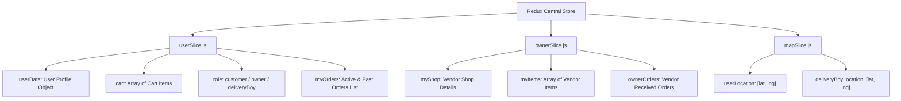
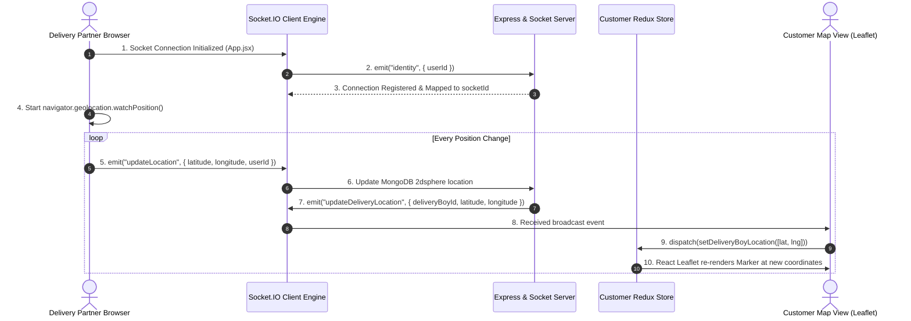

# 🎨 Vingo Frontend — Deep System & Software Architecture Specification

Welcome to the comprehensive architecture document for the **Vingo Frontend**, an enterprise-level dynamic web platform built using **React 18 (Vite)**, **Redux Toolkit**, **Socket.IO Client**, **React-Leaflet Map Engine**, and **TailwindCSS**.

---

## 🏛️ 1. Overall Frontend System Architecture

The Vingo frontend is architected as a single-page application (SPA) with **Role-Driven UI Polymorphism**. Depending on the authenticated user's role (`customer`, `owner`, `deliveryBoy`), the application dynamically hydrates distinct component trees, navigation structures, map controls, and real-time socket listeners.

```
+---------------------------------------------------------------------------------------------------------+
|                                           VITE REACT ENGINE                                             |
|                                            (Root: App.jsx)                                              |
+---------------------------------------------------------------------------------------------------------+
                                                     |
                                                     v
+---------------------------------------------------------------------------------------------------------+
|                                      GLOBAL SERVICES & CONTEXTS                                         |
|  +--------------------------------+  +-------------------------------+  +----------------------------+  |
|  | Redux Toolkit Central Store    |  | Socket.IO Client Gateway      |  | Axios HTTP Client          |  |
|  | (userSlice, ownerSlice, map)   |  | (Identity & Geolocation Sync) |  | (withCredentials: true)    |  |
|  +--------------------------------+  +-------------------------------+  +----------------------------+  |
+---------------------------------------------------------------------------------------------------------+
                                                     |
             +---------------------------------------+---------------------------------------+
             |                                       |                                       |
             v                                       v                                       v
+--------------------------+           +--------------------------+           +--------------------------+
|       CUSTOMER UI        |           |      SHOP OWNER UI       |           |   DELIVERY PARTNER UI    |
| +----------------------+ |           | +----------------------+ |           | +----------------------+ |
| | Nav (Cart Counter)   | |           | | OwnerDashboard       | |           | | DeliveryBoy Dashboard| |
| | UserDashboard (Feed) | |           | | Item Management      | |           | | Broadcast Alert Modal| |
| | Cart & Checkout      | |           | | Order Status Toggles | |           | | Live GPS Tracking Map| |
| | Live Tracking Map    | |           | | Shop Setup/Edit      | |           | | OTP Delivery Complete| |
| +----------------------+ |           | +----------------------+ |           | +----------------------+ |
+--------------------------+           +--------------------------+           +--------------------------+
```

---

## 📊 2. Component Hierarchy & Navigation Routing Matrix

```
App.jsx (Router Base & Global Auth Boot Check)
│
├── Public Routes (Unauthenticated / Guest)
│   ├── /signin ───────────────> SignIn.jsx (Email/Password Login Form)
│   ├── /signup ───────────────> SignUp.jsx (Role Selection & Registration)
│   └── /forgot-password ──────> ForgotPassword.jsx (OTP Email Verification & Reset)
│
└── Authenticated Routes (Wrapped in ProtectedRoute / Role Guards)
    │
    ├── Customer Persona (Role: "customer")
    │   ├── / ─────────────────> Home.jsx / UserDashboard.jsx (Shop Feed, Search, Categories)
    │   ├── /shop/:id ─────────> Shop.jsx (Single Shop Menu & Item Adder)
    │   ├── /cart ─────────────> CartPage.jsx (Cart Items Summary & Quantity Controls)
    │   ├── /checkout ─────────> CheckOut.jsx (Delivery Address Form & Razorpay Payment Modal)
    │   ├── /order-placed ─────> OrderPlaced.jsx (Success Celebration View)
    │   ├── /my-orders ────────> MyOrders.jsx (Order History & Status Stepper)
    │   └── /track-order/:id ──> TrackOrderPage.jsx (Live Driver GPS Map Tracking)
    │
    ├── Shop Owner Persona (Role: "owner")
    │   ├── / ─────────────────> OwnerDashboard.jsx (Shop Analytics, Menu Items, incoming Orders)
    │   ├── /create-shop ──────> CreateEditShop.jsx (Geospatial Shop Setup & Image Upload)
    │   ├── /add-item ─────────> AddItem.jsx (Menu Item Creation Form)
    │   └── /edit-item/:id ────> EditItem.jsx (Item Price & Availability Modifier)
    │
    └── Delivery Partner Persona (Role: "deliveryBoy")
        └── / ─────────────────> DeliveryBoy.jsx (Incoming Delivery Broadcast & Order Acceptance)
            └── Tracking Sub-View -> DeliveryBoyTracking.jsx (GPS Location Broadcaster & Map Route)
```

### Routing & Role Restriction Matrix

| Path | Allowed Roles | Access Restrictions | Core Action / Component |
| :--- | :--- | :--- | :--- |
| `/signin`, `/signup` | All (Guest preferred) | Redirects to `/` if logged in | `SignIn.jsx`, `SignUp.jsx` |
| `/` | `customer`, `owner`, `deliveryBoy` | Renders role-specific Dashboard | `UserDashboard`, `OwnerDashboard`, `DeliveryBoy` |
| `/cart`, `/checkout` | `customer` | Requires non-empty cart | `CartPage.jsx`, `CheckOut.jsx` |
| `/track-order/:id` | `customer` | Order must belong to user | `TrackOrderPage.jsx` |
| `/create-shop`, `/add-item`| `owner` | Owner role validation | `CreateEditShop.jsx`, `AddItem.jsx` |

---

## 🧠 3. Redux Global State Architecture (`src/redux/`)

The application utilizes **Redux Toolkit (`@reduxjs/toolkit`)** for centralized, predictable state management.



### Complete Runtime Redux State Tree Schema

```json
{
  "user": {
    "userData": {
      "_id": "65f1a2b3c4d5e6f7a8b9c0d1",
      "name": "Jane Doe",
      "email": "jane@example.com",
      "role": "customer",
      "location": {
        "type": "Point",
        "coordinates": [77.2090, 28.6139]
      }
    },
    "cart": [
      {
        "_id": "65f1a999c4d5e6f7a8b9c0d2",
        "name": "Paneer Butter Masala",
        "price": 280,
        "quantity": 2,
        "shop": "65f1a888c4d5e6f7a8b9c0d3",
        "image": "https://res.cloudinary.com/vingo/image/upload/v1234/paneer.jpg"
      }
    ],
    "myOrders": []
  },
  "owner": {
    "myShop": {
      "_id": "65f1a888c4d5e6f7a8b9c0d3",
      "name": "Royal Spice Restaurant",
      "address": "Connaught Place, New Delhi"
    },
    "myItems": [],
    "ownerOrders": []
  },
  "map": {
    "userLocation": [28.6139, 77.2090],
    "deliveryBoyLocation": [28.6210, 77.2150]
  }
}
```

---

## ⚡ 4. Real-Time Socket.IO & Geolocation Engine Workflow

The real-time tracking architecture establishes continuous bi-directional communication between the Delivery Driver's browser and the Customer's map view.



### Map Layer & Custom Marker Rendering Specs (`TrackOrderPage.jsx`)
* **Base Map Tiles:** OpenStreetMap via Leaflet (`https://{s}.tile.openstreetmap.org/{z}/{x}/{y}.png`).
* **Marker 1 (Customer Home):** Fixed coordinates fetched from `order.deliveryAddress`.
* **Marker 2 (Restaurant):** Fixed coordinates fetched from `order.subOrders[i].shop.location`.
* **Marker 3 (Delivery Vehicle):** Dynamic marker listening to `state.map.deliveryBoyLocation` updated live via Socket events.

---

## 💳 5. Razorpay Frontend Payment Flow Architecture

```
[Customer clicks "Pay Now" in CheckOut.jsx]
                   │
                   ▼
┌────────────────────────────────────────────────────────┐
│ Load Razorpay SDK Script dynamically in DOM           │
│ Script URL: https://checkout.razorpay.com/v1/checkout.js│
└──────────────────┬─────────────────────────────────────┘
                   │
                   ▼
┌────────────────────────────────────────────────────────┐
│ Dispatch HTTP POST /api/order/place-order              │
│ Payload: { items, deliveryAddress, paymentMethod }     │
└──────────────────┬─────────────────────────────────────┘
                   │
                   ▼
┌────────────────────────────────────────────────────────┐
│ Receive Razorpay Order ID & App Key ID from Backend    │
└──────────────────┬─────────────────────────────────────┘
                   │
                   ▼
┌────────────────────────────────────────────────────────┐
│ Instantiate new window.Razorpay(options) & open Modal  │
└──────────────────┬─────────────────────────────────────┘
                   │
          ┌────────┴────────┐
          │ Payment Result? │
          └───┬─────────┬───┘
   Success    │         │ Failure/Dismiss
              │         └──────────────────────────┐
              ▼                                    ▼
┌────────────────────────────────────────┐ ┌────────────────────────────────┐
│ Trigger handler(response) callback     │ │ Show Toast Error Message       │
│ Payload: { razorpay_order_id,         │ │ Return to Checkout Form        │
│            razorpay_payment_id,        │ └────────────────────────────────┘
│            razorpay_signature }        │
└──────────────────┬─────────────────────┘
                   │
                   ▼
┌────────────────────────────────────────────────────────┐
│ Dispatch HTTP POST /api/order/verify-payment           │
└──────────────────┬─────────────────────────────────────┘
                   │
                   ▼
┌────────────────────────────────────────────────────────┐
│ Clear Redux Cart -> Redirect to /order-placed          │
└────────────────────────────────────────────────────────┘
```

---

## 📂 6. Directory Structure & Module Mapping

```
frontend/src/
├── App.jsx                     # Top-level Router, Socket initialization, Auth persistence
├── main.jsx                    # Entry point wrapping App in Redux Provider & BrowserRouter
├── index.css                   # Global CSS reset & Tailwind directives
├── category.js                 # Static catalog of food categories
├── assets/                     # Static graphics and icons
├── components/
│   ├── Nav.jsx                 # Dynamic top navigation header with cart badge & user menu
│   ├── UserDashboard.jsx       # Customer main discovery feed (Category filter, Shop cards)
│   ├── CategoryCard.jsx        # Clickable category pill component
│   ├── FoodCard.jsx            # Food item card with quantity modifier buttons
│   ├── CartItemCard.jsx        # Row component used inside CartPage
│   ├── UserOrderCard.jsx       # Order history card showing status & track button
│   ├── OwnerDashboard.jsx      # Vendor central hub for order management & items
│   ├── OwnerItemCard.jsx       # Item management card (Price edit, Delete button)
│   ├── OwnerOrderCard.jsx      # Vendor order status transition controller
│   ├── DeliveryBoy.jsx         # Driver alert overlay for broadcasting incoming orders
│   └── DeliveryBoyTracking.jsx # Driver active map navigation view
├── pages/
│   ├── SignIn.jsx              # Customer / Vendor / Driver login form
│   ├── SignUp.jsx              # Multi-role registration form
│   ├── ForgotPassword.jsx      # OTP-based password recovery screen
│   ├── Home.jsx                # Router switch wrapper based on user role
│   ├── Shop.jsx                # Vendor menu grid and category selector
│   ├── CartPage.jsx            # Shopping cart subtotal calculator
│   ├── CheckOut.jsx            # Delivery address input & Razorpay trigger
│   ├── OrderPlaced.jsx         # Success confirmation celebration screen
│   ├── MyOrders.jsx            # List of past/active customer orders
│   ├── TrackOrderPage.jsx      # Live Leaflet tracking map component
│   ├── CreateEditShop.jsx      # Shop onboarding form with map location pin
│   ├── AddItem.jsx             # Food item creation form with Cloudinary upload
│   └── EditItem.jsx            # Food item update screen
├── redux/
│   ├── store.js                # Redux store configuration combining slices
│   ├── userSlice.js            # Auth user, cart state, role, order history
│   ├── ownerSlice.js           # Vendor shop profile, items array, orders
│   └── mapSlice.js             # Lat/Lng tracking state for maps
└── hooks/                      # Custom utility hooks
```

---

## 🛠️ 7. Development & Production Deployment Blueprint

### Development Command
```bash
# Run local development server with Vite HMR
npm run dev
```

### Production Build Command
```bash
# Build optimized static bundle
npm run build

# Preview production build locally
npm run preview
```
